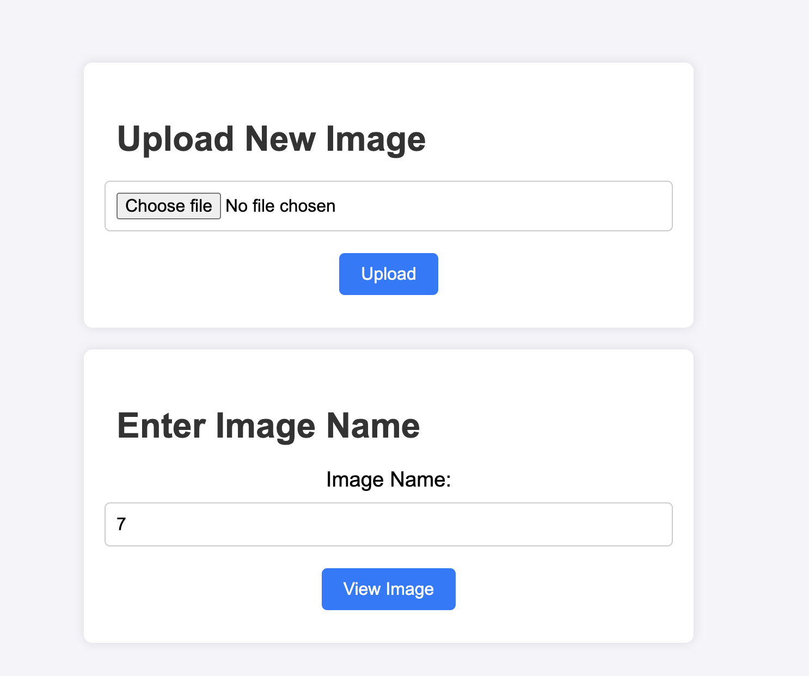
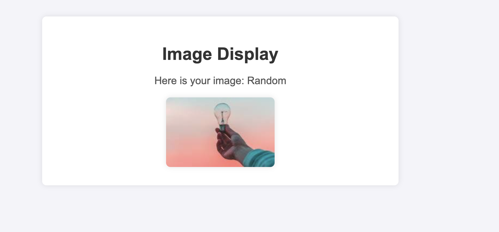

# Flask ECS App for Image Upload and Download

This Flask application provides functionality to upload and download images from an Amazon S3 bucket. The app is designed to run on Amazon ECS and interacts with AWS services using specific IAM permissions.

## Routes

### `/image?image_name={image_name}`
- **Description**: Displays images available in the S3 bucket.
- **Details**:
  - Images must be present in s3 bucket.
  - The route displays image provided in request fetching the corresponding images from the bucket.
  - Requires the following permissions:
    - `s3:GetObject`
    - `kms:Decrypt`

### `/upload`
- **Description**: Uploads an image to the specified S3 bucket.
- **Details**:
  - Users can upload images to the bucket provided in the environment variables.
  - only .jpg format is accepted
  - Requires the following permissions:
    - `s3:PutObject`
    - `kms:Encrypt`
    - `kms:GenerateDataKey`

### `/health`
- **Description**: A simple health check endpoint.
- **Details**: Returns a status indicating the health of the application.

## Environment Variables
The following environment variables must be set for the application to function correctly:

- `IMAGES_BUCKET`: The name of your S3 bucket where images are stored.
- `AWS_REGION`: The AWS region where the ECS task is running.

## Setting Up the Application

### Prerequisites
- AWS account with an S3 bucket.
- IAM role with the necessary permissions.
- Docker and AWS CLI installed.
- ECS cluster configured.

### Steps
1. **Clone the Repository**:
   ```bash
   git clone https://github.com/your-repo/ImagesRepo.git
   cd ImagesRepo
   ```

2. **Build the Docker Image**:
   ```bash
   docker build -t flask-ecs-image-app .
   ```

3. **Run the Container Locally** (for testing): 
   ```bash
   docker run -e IMAGES_BUCKET=your-bucket-name -e AWS_REGION=your-region -p 5000:5000 flask-ecs-image-app
   ```
   
4. **Deploy on ECS**:
   - Create an ECS task definition with the necessary environment variables and IAM role.
   - Create a service using this task definition.

## Permissions Required

### IAM Role Permissions
Ensure the IAM role attached to your ECS task has the following permissions:

- **For `/image?image_name={image_name}` route**:
  - `s3:GetObject`
  - `kms:Decrypt`

- **For `/upload` route**:
  - `s3:PutObject`
  - `kms:Encrypt`
  - `kms:GenerateDataKey`

## Example

### Uploading an Image
You can upload an image using a tool like `curl` or Postman:
```bash
curl -X POST -F "file=@path/to/your/image.jpg" http://localhost:5000/upload
```

### Viewing Images
Navigate to `http://localhost:5000/image?image_name=image` to see a random selection of images from your S3 bucket.

### Health Check
Visit `http://localhost:5000/health` to perform a health check on the application.

## Already build image for app which is public 
```docker pull srokade/s3ecsapp:image5```

## Conclusion
This Flask application provides a simple interface for uploading and downloading images to and from an S3 bucket, leveraging AWS services and running on ECS. Ensure all necessary environment variables are set and IAM permissions are correctly configured for seamless operation.

### Main page view



### Image Display view



